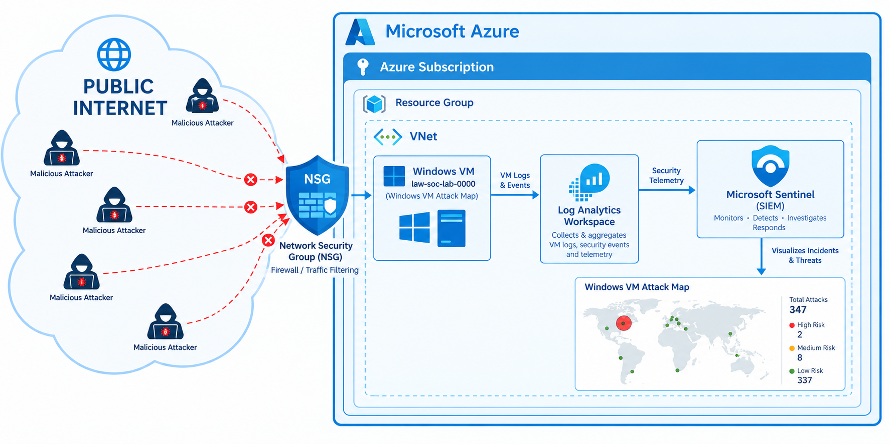
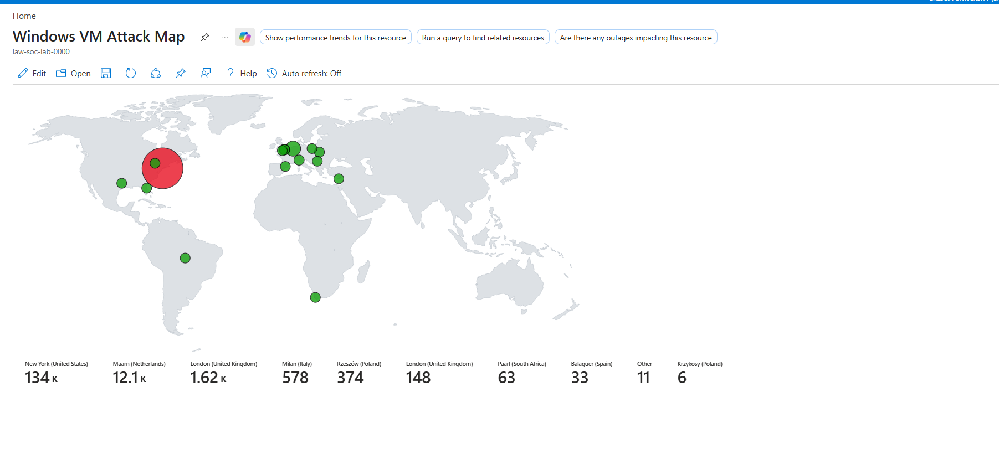

# Azure Honeypot SOC Lab

A hands-on home SOC project: an intentionally exposed Windows VM on Azure, monitored end-to-end with Microsoft Sentinel, used to observe and analyze real-world attack traffic from the public internet.



## Overview

I deployed a Windows Server VM on Azure with RDP (port 3389) fully open to the public internet — no restrictions on source IP. Within hours, the VM was being actively scanned and brute-forced by automated bots from around the world.

I then built a full logging and detection pipeline to capture, centralize, and visualize that traffic:

- **Azure VM** — intentionally exposed "bait" system, no real data, fully isolated from any other environment
- **Network Security Group (NSG)** — configured to allow all inbound traffic, maximizing discoverability
- **Azure Monitor Agent** — forwards Windows Security Event logs from the VM
- **Log Analytics Workspace** — central log repository, queried with KQL (Kusto Query Language)
- **Microsoft Sentinel (SIEM)** — connected to the workspace for monitoring, querying, and visualization
- **GeoIP Watchlist** — IP-to-location mapping table uploaded to Sentinel, used to enrich attacker IPs with city/country/coordinates
- **Attack Map Workbook** — a Sentinel workbook that plots failed login attempts on a world map by geolocation

## Results (first 24 hours)

| Metric | Value |
|---|---|
| Total failed login attempts (Event ID 4625) | **149,374** |
| Countries observed | 7+ (United States, Netherlands, United Kingdom, Italy, Poland, South Africa, Spain) |
| Most targeted account names | `administrator`, `admin`, `user`, `server` |

**Top attacking countries:**

| Country | Failed Attempts |
|---|---|
| United States | 134,451 |
| Netherlands | 12,086 |
| United Kingdom | 1,771 |
| Italy | 586 |
| Poland | 374 |
| South Africa | 63 |
| Spain | 33 |

**Top targeted accounts:**

| Account | Attempts |
|---|---|
| ADMINISTRATOR | 19,183 |
| ADMIN | 19,135 |
| USER | 19,126 |
| SERVER | 17,062 |



## Architecture

```
Public Internet
      │
      ▼ (RDP 3389, no source restriction)
Network Security Group (NSG)
      │
      ▼
Windows VM  ──── VM Logs & Events ────►  Log Analytics Workspace
      │                                          │
      │                                          ▼ Security Telemetry
      │                                  Microsoft Sentinel (SIEM)
      │                                          │
      │                                          ▼
      │                                  Attack Map Workbook
      │                                  (visualizes incidents & threats)
```

## KQL Queries

All queries are in [`kql-queries/`](kql-queries/):

- [`failed-logon-count.kql`](kql-queries/failed-logon-count.kql) — total count of Event ID 4625 (failed logon)
- [`top-attacking-countries.kql`](kql-queries/top-attacking-countries.kql) — failed logons enriched with GeoIP data, grouped by country
- [`top-targeted-accounts.kql`](kql-queries/top-targeted-accounts.kql) — most frequently attempted account names

The Sentinel workbook JSON used to render the attack map is in [`workbook/attack-map-workbook.json`](workbook/attack-map-workbook.json).

## What I Learned

- **How fast exposed systems get discovered.** Automated scanners find open ports on cloud IP ranges within minutes to hours — this isn't theoretical, it's measurable.
- **Practical SIEM operation.** Configuring Microsoft Sentinel, connecting a Log Analytics Workspace, and building custom detections/visualizations from raw event data.
- **KQL fundamentals.** Filtering, aggregating (`summarize`), and enriching data (`evaluate ipv4_lookup`) against a reference table (watchlist).
- **Threat intelligence basics.** Cross-referencing attacker IPs against GeoIP data to understand the origin and distribution of attack traffic.
- **Limitations of the data.** The GeoIP watchlist used is a summarized dataset — it doesn't resolve every IP block, so the map reflects a representative sample rather than every single attempted connection.

## Notes on Safety

- The VM contains no real data, is not joined to any other network, and uses credentials that are not reused anywhere else.
- The public IP referenced in earlier testing has been intentionally left out of this repository.
- This project is a personal learning lab, not a production security control.

## Tech Stack

`Microsoft Azure` · `Azure Virtual Machines` · `Network Security Groups` · `Azure Monitor Agent` · `Log Analytics Workspace` · `Microsoft Sentinel` · `KQL`

---

Built by [Miguel Veloso](https://VelosoMiguel.github.io) — Computer Science student, aspiring cybersecurity analyst.
